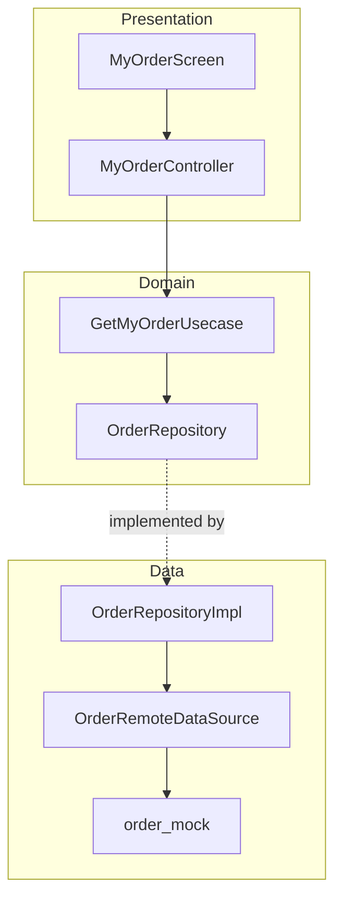

# Tuku Shop

| | |
|---|---|
| Overview | Flutter e-commerce shopping app (*tuku* = "to buy" in Javanese), UI based on the [Kutuku Figma template](https://www.figma.com/design/MWXnUlavawxNQSMaYIsRRh/Kutuku----eCommerce-Mobile-App-UI-Kit-Figma-High-Quality-Template--Community-?node-id=0-1&p=f) |
| Last edit | 2026-09-29 |
| Author | Dam Hong Duc |

## Store links

| Platform | Link |
|---|---|
| App Store | Not published |
| Google Play | Not published |

## App IDs

| ID | Value |
|---|---|
| iOS bundle ID | `app.dd.tuku.shop` |
| Android app ID | `com.dd.tuku.shop` |
| Android namespace | `com.dd.tuku.shop` |

## Tech stack

| Category | Technology | Version |
|---|---|---|
| Framework | Flutter | 3.38.8 |
| Language | Dart | 3.10.7 |
| State management | flutter_bloc (Cubit) | 9.1.1 |
| Backend | Firebase (`firebase_core` only); feature data comes from `data/mock/` | 4.11.0 |
| Local DB | None | - |
| Special libraries | `system_design_flutter` (in-house design system, git submodule) | pinned by commit |

## Project architecture

| | |
|---|---|
| Architecture | Feature-first Clean Architecture + Cubit |
| Encryption | None |

