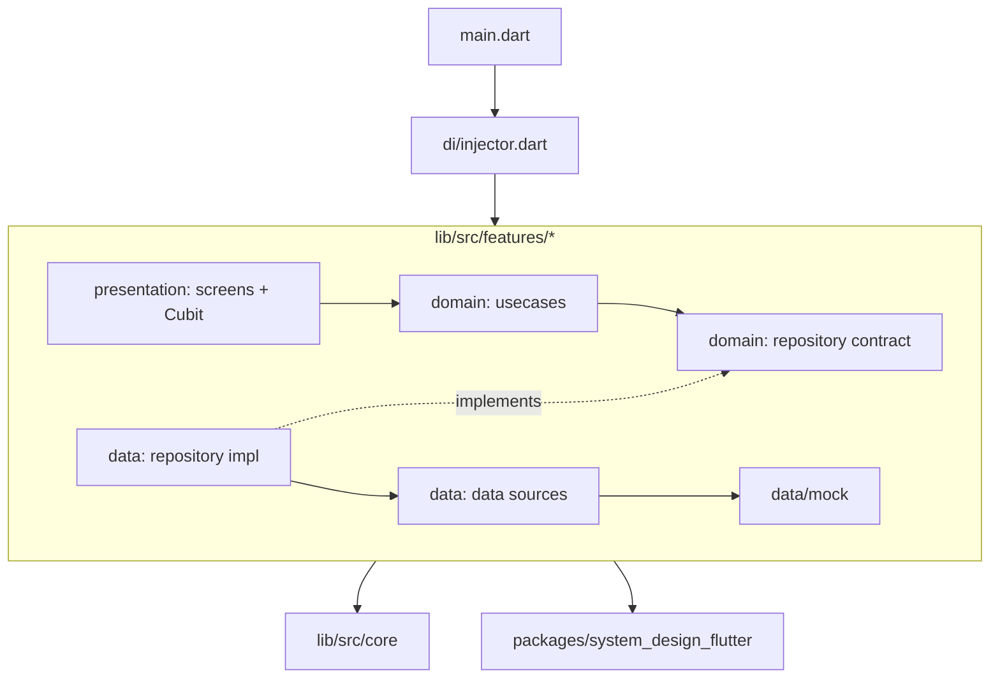

# Tuku Shop

| | |
|---|---|
| Overview | Flutter e-commerce shopping app (*tuku* = "to buy" in Javanese), UI based on the [Kutuku Figma template](https://www.figma.com/design/MWXnUlavawxNQSMaYIsRRh/Kutuku----eCommerce-Mobile-App-UI-Kit-Figma-High-Quality-Template--Community-?node-id=0-1&p=f) |
| Last edit | 2026-09-29 |
| Author | Dam Hong Duc |

## Store links

| Platform | Link |
|---|---|
| App Store | Not published |
| Google Play | Not published |

## App IDs

| Platform | Flavor / scheme | ID type | Value |
|---|---|---|---|
| Android | - | applicationId | `com.dd.tuku.shop` |
| Android | - | namespace | `com.dd.tuku.shop` |
| iOS | Runner | Bundle ID | `app.dd.tuku.shop` |
| iOS | RunnerTests | Bundle ID | `app.dd.tuku.shop.RunnerTests` |
| macOS | Runner | Bundle ID | `app.dd.tuku.shop` |
| Linux | - | Application ID | `com.dd.tuku.shop` |
| Dart | - | Package name | `tuku_shop` |
| Firebase | - | Project ID | `dutuku-e-commerce` (legacy, cannot be renamed) |

## Tech stack

| Category | Technology | Version |
|---|---|---|
| Framework | Flutter (pinned in `.fvmrc`) | 3.38.8 |
| Language | Dart | 3.10.7 |
| State management | flutter_bloc (Cubit) | 9.1.1 |
| Functional errors | dartz (`Either<Failure, T>`) | 0.10.1 |
| DI | get_it + injectable | 8.0.3 / 2.5.0 |
| Routing | go_router | 15.1.3 |
| Theming | adaptive_theme | 3.7.0 |
| Localization | intl + flutter gen-l10n | 0.20.2 |
| Backend | firebase_core | 4.11.0 |
| Design system | `system_design_flutter` (git submodule, `packages/`) | pinned by commit |
| Workspace | melos | 6.3.3 |
| Testing | bloc_test + mocktail | 10.0.0 / 1.0.5 |
| Release | Fastlane + Firebase App Distribution | - |

## Project architecture

