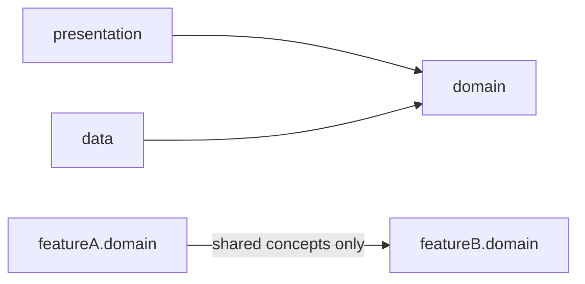
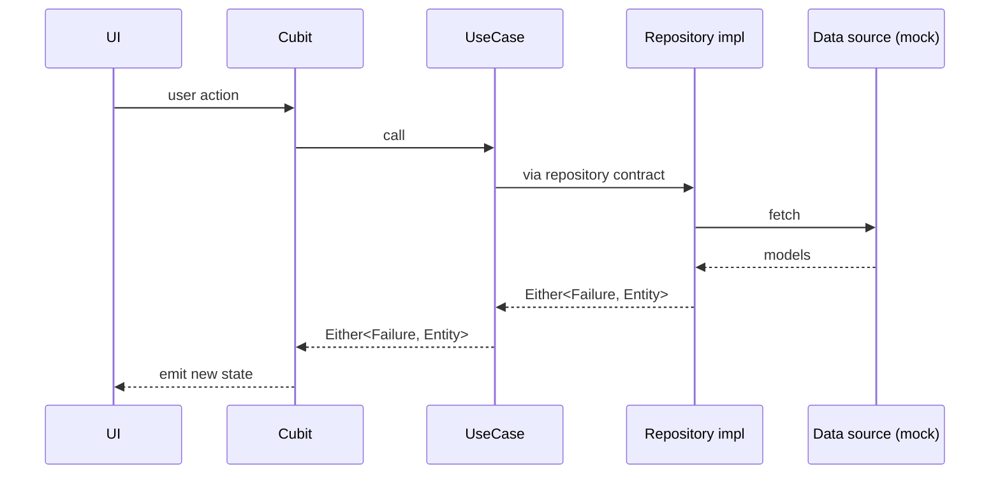

# Architecture

Feature-based Clean Architecture: each feature owns its `domain` / `data` / `presentation` slice under [lib/src/features/](../lib/src/features/).

## Folders

| Path | Contents |
|---|---|
| `lib/src/features/product/` | Product detail, search, recommended products |
| `lib/src/features/order/` | My orders + order detail |
| `lib/src/features/banner/`, `category/`, `notification/`, `profile/` | Feature slices |
| `lib/src/features/home/` | Presentation only: composes banner / category / product sections |
| `lib/src/features/splash/`, `tutorial/`, `login/`, `register/`, `bottom_tab/`, `preview_media/` | Screen flows |
| `lib/src/core/` | Constants, enums, env, exceptions, failures, l10n, navigation, resources, usecase base, utils, shared widgets |
| `lib/src/di/injector.dart` | Calls each feature's `<Feature>Di.config()` |

## Feature layers

| Layer | Contents |
|---|---|
| `domain/` | Entities, repository contract, usecases, `domain.dart` barrel |
| `data/` | Models (DTOs), mappers, mock, data sources, repository impl |
| `presentation/` | Screens, Cubit controllers/states, feature-local widgets |

## Dependency rule

A feature exposes only its `domain/domain.dart` barrel, except to the presentation-only `home/` and `bottom_tab/`, which compose other features' sections.

## Data flow

`data/mock/*` stands in for a real API; swapping it only touches that feature's `data` layer.

## Backend DB design

| Resource | Link |
|---|---|
| DB design (Google Drive) | https://drive.google.com/file/d/1vY04Wm6R2z69D4JhJ8cdIqszU7TTXFpA/view?usp=sharing |
